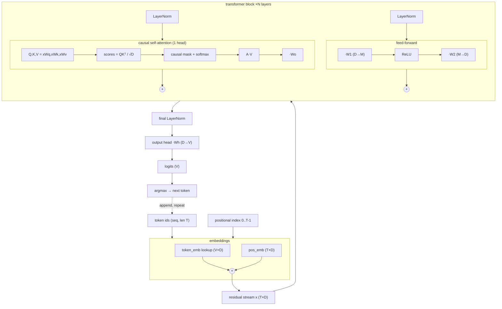
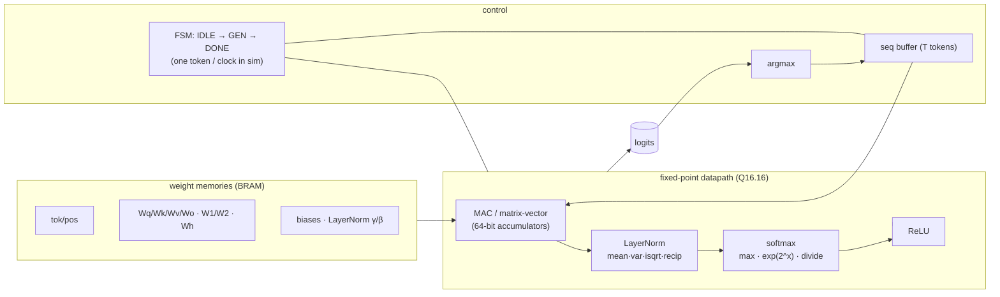
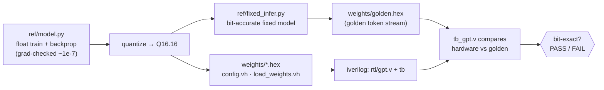

# Architecture

Three views: the **model** (what it computes), the **hardware** (how the RTL is
organized), and the **build/verify flow** (how we know it's correct).

## 1. Model dataflow

A decoder-only transformer (GPT family). One token id in → probability of the
next token out. Greedy decoding feeds the argmax back in (autoregression).

Default dims: `D=32, N=2, heads=1, T=24, M=64, V=28` (character-level).

## 2. Hardware organization (`rtl/gpt.v`)

Weights live in on-chip memories loaded at init via `$readmemh`. A small FSM
drives one **full forward pass per generated token**; the datapath is built
entirely from the fixed-point primitives in `rtl/fixed_pkg.vh`.

### Fixed-point primitives (`fixed_pkg.vh`)

Everything is signed **Q16.16** (16 integer + 16 fractional bits) in 32-bit
words, with 64-bit accumulators and saturation. Each function is a bit-for-bit
port of `ref/fixed.py`:

| function | op | hardware technique |
|---|---|---|
| `fmul` | Q×Q | 64-bit product, arithmetic shift, saturate |
| `fadd/fsub` | Q±Q | saturating |
| `fdiv` | Q÷Q | signed divide (truncating) |
| `isqrt`/`fsqrt` | √ | classic bit-by-bit integer square root |
| `frsqrt` | 1/√ | `fsqrt` then reciprocal (for LayerNorm) |
| `fexp_neg` | eˣ, x≤0 | `2^(x·log₂e)`, split int/frac, cubic poly for `2^frac` |

## 3. Build & verify flow

The hardware isn't *approximately* a transformer — it is **bit-exact** with a
software golden model. That equivalence is the whole point.

`ref/fixed.py` and `rtl/fixed_pkg.vh` implement the *same integer arithmetic*,
so the RTL reproduces the golden token stream exactly (verified for all 24
generated tokens).
