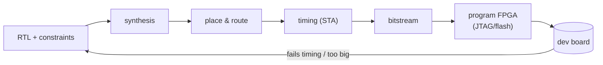

# From RTL to FPGA to ASIC

How you'd actually get this design onto real silicon, the honest engineering
caveats, and what changes along the way. (Costs are in
[COST.md](COST.md).)

---

## 0. Reality check: the current RTL is "simulation-shaped"

`rtl/gpt.v` is written for **clarity and bit-exact verification**, not for
silicon. The whole forward pass is described behaviorally — nested `for` loops
that do entire matrix multiplies "in one clock," and a `task` that runs a full
token per cycle. That:

- simulates perfectly in Icarus Verilog (what we use to prove correctness), and
- *technically* elaborates, but would synthesize to an absurd amount of
  combinational logic (thousands of multipliers fully unrolled) with a
  multi-microsecond critical path. No tool will close timing on it.

So step 1 of *productizing* is a **micro-architecture rewrite** that keeps the
exact same fixed-point math (and therefore the same bit-exact golden test) but
schedules it onto real resources:

| concern | sim version (today) | silicon version (needed) |
|---|---|---|
| matmuls | unrolled `for` loops | a small array of MAC units + an FSM that streams operands |
| weights | `reg` arrays, all read at once | BRAM / external DRAM, read as a stream |
| timing | one token/clock | hundreds–thousands of clocks/token, pipelined |
| `exp`, `1/√x`, `÷` | functions with `while` loops | pipelined units or LUT+Newton iterations |
| numerics | **unchanged** Q16.16 — golden test still passes |

The golden-model harness (`ref/fixed_infer.py` + `tb_gpt.v`) is the safety net:
you refactor the RTL aggressively and the testbench tells you the instant a
single output bit drifts.

---

## 1. FPGA path

FPGAs are the right first target: reprogrammable, no fabrication, fast iteration.

**Toolchains**
- *Open source* (great for small parts): **Yosys** (synth) + **nextpnr** (P&R) +
  **Verilator/Icarus** (sim), targeting **Lattice iCE40 / ECP5**. Zero license cost.
- *Vendor*: **AMD/Xilinx Vivado** (Artix/Zynq/Versal) or **Intel Quartus**.
  Vivado's free tier covers many mid-size parts; the full tool is a paid seat.

**Boards, smallest → biggest**
- iCEBreaker / TinyFPGA (iCE40) — fine for a stripped version.
- **Arty A7-35/100** (Artix-7) or a **Zynq** board — comfortable for this model
  with a proper MAC datapath; Zynq lets an ARM core feed prompts over AXI.
- Alveo / VCK5000 datacenter cards — only relevant once you scale to a *real*
  (multi-billion-parameter) model and need HBM bandwidth.

**Deliverable:** a board that takes a prompt (UART/AXI) and streams generated
characters back — a genuine hardware LLM you can hold.

---

## 2. ASIC path

Only worth it once the FPGA version is proven and you actually need the
volume/power/latency wins of a custom chip. Two tiers:

### 2a. Prototype via a shuttle / MPW (Multi-Project Wafer)

Many designs share one mask set, so you pay a fraction of full NRE and get tens
of packaged chips. The cheap on-ramp.

```mermaid
flowchart LR
    rtl[RTL] --> dft["add DFT (scan/BIST)"]
    dft --> syn["logic synthesis<br/>(Yosys / Synopsys DC)"]
    syn --> floor[floorplan]
    floor --> cts["clock tree synth"]
    cts --> pnr["place & route<br/>(OpenROAD / Innovus)"]
    pnr --> sign["signoff: STA, DRC, LVS, power"]
    sign --> gds[GDSII]
    gds --> mpw["MPW shuttle slot<br/>(Sky130 / 65nm / 28nm)"]
    mpw --> fab[fab + packaging]
    fab --> test[bring-up & test]
```

- **TinyTapeout** — the cheapest "I taped out a chip" route (Sky130/GF180,
  shared tile). Educational; this model is bigger than one tile so it'd span
  several or need trimming.
- **Open-PDK flow** — **OpenLane/OpenROAD** on **SkyWater Sky130** or **IHP
  SG13G2**: fully open RTL→GDSII. Submit through an academic/commercial shuttle
  (Europractice, MOSIS, IHP). *(Note: Efabless, the popular Sky130 shuttle
  broker, wound down in 2025 — confirm a current broker before planning.)*
- **Commercial MPW** at a foundry (TSMC/GF/UMC via Europractice/MOSIS) for
  28nm/22nm if you need real performance/density.

### 2b. Full production tapeout

Your own reticle, full wafer lots, thousands–millions of die. This is a
company-scale program: dedicated mask set, commercial EDA, IP licensing
(SRAM compilers, PLL, I/O, DDR/PCIe PHYs), packaging, qualification, firmware,
and a multi-person team for 12–24 months. See [COST.md](COST.md).

---

## 3. What "good" looks like for a *real* LLM accelerator

If the goal were a serious product (not this 28-token toy), the architecture
grows into the same shape every inference chip converges on:

- a **systolic / dataflow array** of MACs (this design's matvec, massively
  parallelized),
- **weight streaming from HBM/DDR** (weights no longer fit on-chip),
- **lower-precision numerics** (INT8/INT4/FP8, per-channel scaling) instead of
  Q16.16,
- **KV-cache** SRAM so you don't recompute attention each step,
- fused, pipelined LayerNorm/softmax/GELU units,
- a host interface (PCIe) and a compiler that maps model graphs onto the array.

That's the leap from "a working transformer in Verilog" to "a chip that competes
with a GPU" — and it's where essentially all the cost and risk live.
